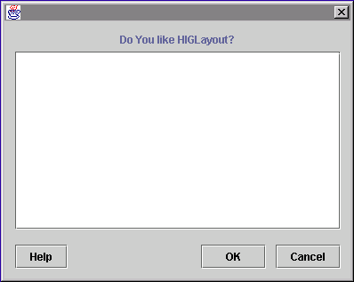
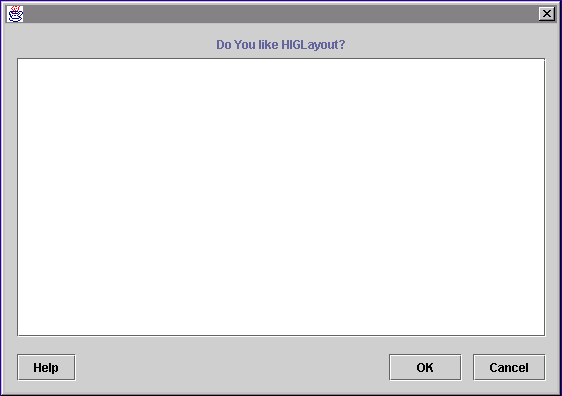
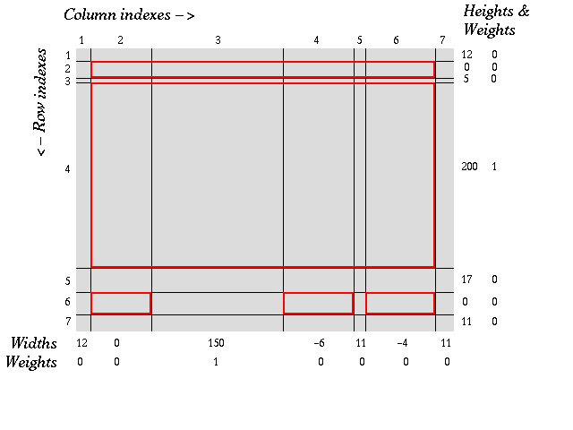
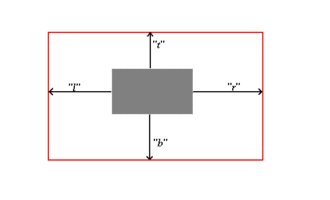

HIGLayout tutorial
==================

Original by Daniel Michalik (dmi@autel.cz), April 2002 (version 1.0a)

Updated by Jaap Geurts (jaapg /a-t/ gmx - net), September 2014 (version 1.1)

What  developers are saying
--------------------------
- *"I am most of the time a happy user of your `HIGLayout`, thanks for having done the best layout I am aware of."*
- *"I have been using `HIGLayout` for the past three weeks and have found it very useful."*
- *"I love `HIGLayout`."*

Why You may need a new Layout Manager
-------------------------------------

I decided to resurrect `HIGLayout` and port it to Android after frustration of having to work with `RelativeLayout` or `LinearLayout`. Positioning with `RelativeLayout` is rather unpredictable and thus time consuming. `LinearLayout` is simple and easy to use but often results in many nested `LinearLayout` which is bad for performance. I remembered using `HIGLayout` from a long time ago and it`s a powerful Layout Manager that can handle many layouts common layouts in a simple way.

What I expect of good Layout Manager:

- Requires a minimum of nested `ViewGroups` to get appropriate layout,
- Does not require to derive new `View` classes and overload `onMeasure()` or,
- Allows proper re-sizing of `ViewGroup`,
- Easy interview spacing (using absolute numbers),
- Alignment of position and size,
- Easy to use in real life programs, not just some artificial examples,
- Freely available.

I hope that `HIGLayout` `ViewGroup` satisfies the above criteria. It was created under the LGPL license which gives you the opportunity to use it in open and closed source programs. The following screenshots give you a preview of the posibilities with `HIGLayout`:

The following dialog has only one `ViewGroup`. Note that buttons **OK** and **Cancel** have equal width. The same would be true, if the text on the buttons were in another language, where their widths were opposite. The label on top of the text area is aligned in center.



The same dialog re-sized. The label still remains aligned in center:



Coordinate system
-----------------

`HIGLayout` is based on the idea of a **design grid** which divides the layout area into rows and columns. Both are indexed from 0. Any rectangle built from cells we will call **views's target area**. This rectangle is specified by the column and row indexes of top left cell, width by number of columns and height by number of rows.

The following figure shows the design grid used by the dialog on the figure above. Red rectangles mark target view areas. Views are placed into these areas.



There are 3 ways to specify the width of a column or the height of a row:

- By absolute number in pixels > 0.
- By 0, which means the default size of the `View` in the column or row provided the View's target area has width 1 (for column) or height 1 (for row).
In our example the label on the second row determines its height. The third column does not contain any view target area of width 1, so its width is set to an absolute size.
- By number < 0. If **i-th** column's (row's) width (height) is specified by number **-n** then **i-th** column (row) will take its width (height) from **n-th** column (row). There can be cycles: see on widths of 4th and 6th column. This can be useful in case, when there is need to ensure equal width of button group (for example **OK**, **Cancel**.

Resizing
--------

Suppose a width of `ViewGroup` will enlarge by **n** pixels. This number is then distributed among the columns depending on column weights. Let **S** be the sum of all column weights, and **Wi** is the weight of **i-th** column. Then **i-th** column width will be increased by **n*(Wi/S)**. The same is true for rows.

In our example the text area re-sizes because only the third column and fourth row have nonzero weights. When enlarging width, buttons **OK**, **Cancel** also move with the right border of the window.

Anchors
-------

The layout algorithm gives Views the size requested when sizes are set to `WRAP_CONTENT`. Then the `View` is placed into center of its target area. Anchors can be specified which tells the layout algorithm how to move or re-size view to the borders of the target area. Anchors are specified by a single string of characters **l, r, t, b** (case sensitive!). These mean: directions **left, right, top, bottom**. In horizontal direction, first appearance of letter **l** (or **r**) moves view to left (right) border, second re-sizes it into right (left) border of target area. The same is true for vertical direction and letters **t** and **b**.

The default anchor string is "lrtb". In our example the label in second row has empty anchor string - that is why it is aligned in center.



Listing
-------
```XML
<com.proficiosoftware.higlayout.HIGLayout xmlns:android="http://schemas.android.com/apk/res/android"
    xmlns:tools="http://schemas.android.com/tools"
    xmlns:higlayout="http://schemas.android.com/apk/res-auto"
    android:id="@+id/HIGLayout1"
    android:layout_width="match_parent"
    android:layout_height="match_parent"
    android:padding="15dp"
    higlayout:column_weights="0,1,0,0,0"
    higlayout:column_widths="0,150,-4,15,-2"
    higlayout:row_heights="0,15,150,15,0"
    higlayout:row_weights="0,0,1,0,0"
    higlayout:show_grid="false"
    tools:context="com.proficiosoftware.higlayouttest.MainActivity" >

    <TextView
        android:id="@+id/textView1"
        android:layout_width="wrap_content"
        android:layout_height="wrap_content"
        higlayout:layout_anchor=""
        higlayout:layout_cellX="0"
        higlayout:layout_cellY="0"
        higlayout:layout_spanX="5"
        higlayout:layout_spanY="1"
        android:text="Do you like HIGLayout?"
        android:textAppearance="?android:attr/textAppearanceLarge" />

    <EditText
        android:id="@+id/editText1"
        android:layout_width="wrap_content"
        android:layout_height="wrap_content"
        higlayout:layout_cellX="0"
        higlayout:layout_cellY="2"
        higlayout:layout_spanX="5"
        higlayout:layout_spanY="1"
        android:ems="10"
        android:inputType="textMultiLine"
        android:text="Lorem ipsum delor semet" >

        <requestFocus />
    </EditText>

    <Button
        android:id="@+id/button1"
        android:layout_width="wrap_content"
        android:layout_height="wrap_content"
        higlayout:layout_cellX="0"
        higlayout:layout_cellY="4"
        higlayout:layout_spanX="1"
        higlayout:layout_spanY="1"
        android:gravity="center"
        android:text="Help" />

    <Button
        android:id="@+id/button2"
        android:layout_width="wrap_content"
        android:layout_height="wrap_content"
        higlayout:layout_cellX="2"
        higlayout:layout_cellY="4"
        higlayout:layout_spanX="1"
        higlayout:layout_spanY="1"
        android:gravity="center"
        android:text="OK" />

    <Button
        android:id="@+id/button3"
        android:layout_width="wrap_content"
        android:layout_height="wrap_content"
        higlayout:layout_cellX="4"
        higlayout:layout_cellY="4"
        higlayout:layout_spanX="1"
        higlayout:layout_spanY="1"
        android:gravity="center"
        android:text="Cancel" />

</com.proficiosoftware.higlayout.HIGLayout>
```

This code can be found in the download file **examples/Demo2Dialog.java**.

### Download `HIGLayout` package
If you want to use `HIGLayout`, feel free to <a href="http://www.autel.cz/dmi/HIGLayout1.0.zip">download</a> it. Good luck!

Contribute
__________

You are welcome to contribute. You can clone, make a new branch, and make a pull request

FAQ
---
- Q: Why don't my buttons align with the grid.

    A: Because android buttons use a 9-patch image for their background. That background has a transparent border. Try setting the background to null like so: `android:background="@null"`. Create your own 9-patch to fix the problem.

- Q: Why do `MATCH_PARENT` / `FILL_PARENT` not work.

    A: `HIGLayout` uses Anchors to re-size a `View` from its original `WRAP_CONTENT` size. Since `HIGLayout` uses a grid, re-sizing the child view to cover the whole grid makes no sense.

TODO
----

- Allow all "pixel" values to be specified with qualifier dp/sp/px, and handle it correctly
- Merge `calcWidths()` & `calcHeights()` to improve measuring performance
- Add methods to set all parameters at run time to allow programmatic creation of `HIGLayout`


History
-------

### Version 1.1
Ported to Android and modified by Jaap Geurts

### Version 1.0a
Updated download link in this document

### Version 1.0
There are several bug fixes and new features provided kindly by several contributors.
Fixed bugs:
- some methods throw `NullPointerException`,
- `HIGLayout` does not handle invisible components correctly,
- method `r` in class `HIGConstraints` incorrectly implemented.

*New feature*

- Now it is possible to set preferred size of row or column instead of preferred size on inserted views.

*Thanks*

Many thanks to all, who contributed to version 1.1:

- Frank Behrens (frank@pinky.sax.de),
- Sven Behrens (behrens@disy.net),
- Romano Caserta (caserta@disy.net),
- Alberto Ricart (aricart@smartsoft.com),
- Peter Reilly (Peter.Reilly@marconi.com)

Special thanks to *Sun Microsystems* for sponsoring great on-line available books. Without the book **Java Look and Feel Design Guidelines** there would be no `HIGLayout`.

### Version 0.99
- Many thanks to Frank Behrens for contributing bug fix for strange behaviour I was unable to track. Without this fix, `HIGLayout` would not have been further pushed towards version 1.0.

### Version 0.98 (April 2000)
- `HIGLayout` caches some computations to speed up layout when used in nested containers,
- Has new methods `setColumnWidth(col, w)` and `setRowHeight(row, h)` to be more Java Beans compliant.
- Number of columns and rows can grow,
- Properly handles container's insets,
- Methods `getColumnsX(int)` and `getRowsY(int)` are no longer public.

### Version 0.95 (December 1999)
First public version.